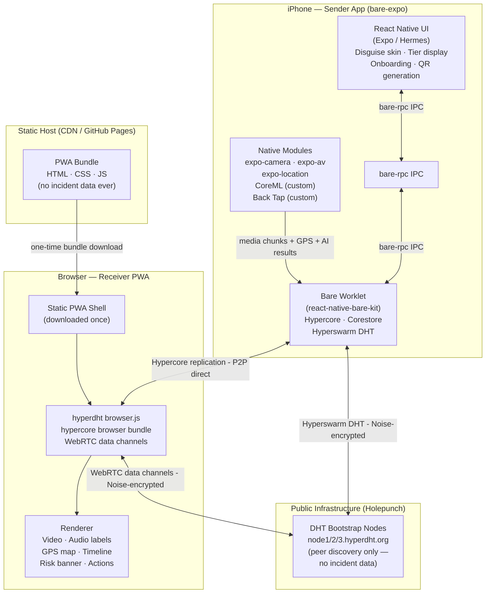
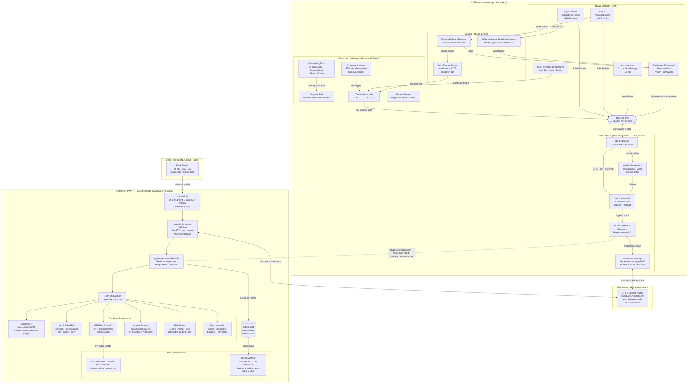
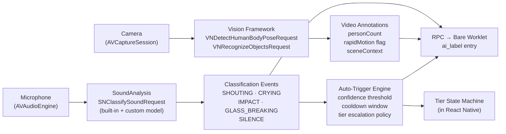
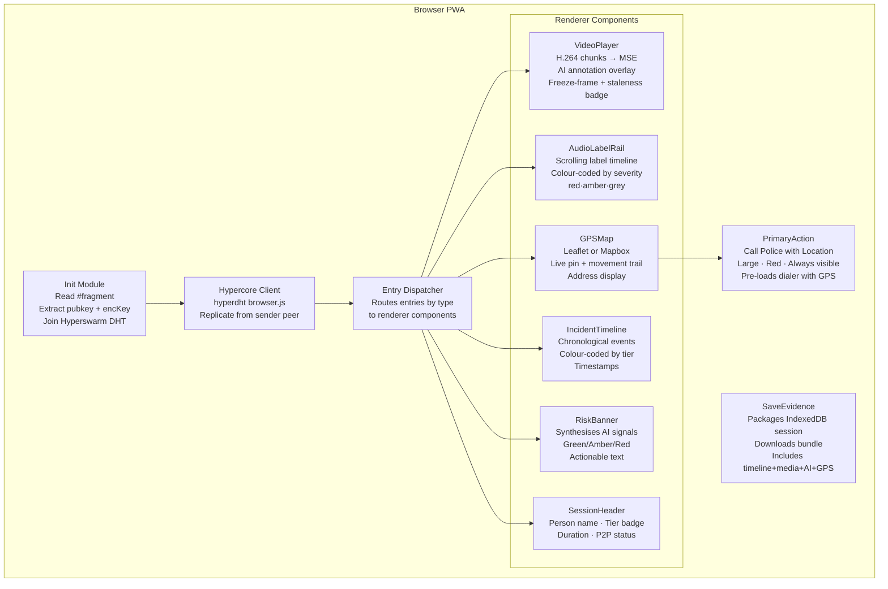

# SafeHaven System Architecture
Date: 2026-04-25
Version: 1.0 (Hackathon MVP)

## 1. Architecture Overview

SafeHaven is a fully serverless P2P safety system built on the Pear protocol (Hypercore + Hyperswarm + Bare runtime). Incident data flows exclusively peer-to-peer between the sender's iPhone and the trusted contact's browser. The only non-P2P component is a dumb static file host that serves the receiver PWA bundle once.

### Component Diagram



### Detailed Component Diagram



---

## 2. iOS Sender App — Component Structure

### 2.1 React Native UI Layer (Hermes)

| Component | Responsibility |
|---|---|
| `DisguiseShell` | Renders the active disguise skin (weather/podcast). Covers all safety UI. |
| `TierIndicator` | Subtle visual state indicator only visible to the user (e.g. corner dot colour). |
| `CodewordListener` | Bridges speech recognition results from the native layer to tier state transitions. |
| `OnboardingFlow` | Setup wizard: codeword config, trusted contact setup, QR/link generation, shortcut guide. |
| `QRGenerator` | Renders QR code from `#<pubkey>:<encryptionKey>` for trusted contact pairing. |
| `TierStateMachine` | React state machine: IDLE → T1 → T2 → T3. Sends tier change commands to Bare Worklet via bare-rpc. |
| `SettingsScreen` | Hidden behind disguise — long-press or shortcut to access. |

### 2.2 Bare Worklet (P2P Layer)

Runs in a separate thread via `react-native-bare-kit`. Uses the Bare runtime — NOT Hermes. All Hypercore/Hyperswarm code lives here.

| Module | Responsibility |
|---|---|
| `incident-core.mjs` | Creates and manages the Corestore + incident Hypercore. Handles all append operations. |
| `swarm-manager.mjs` | Manages Hyperswarm join/leave. Announces on the incident topic derived from the Hypercore public key. |
| `entry-writer.mjs` | Serialises and appends typed entries to the Hypercore log. |
| `media-chunker.mjs` | Receives raw audio/video buffers from RPC, chunks them, appends as Hypercore entries. |
| `rpc-bridge.mjs` | Listens on `bare-rpc` IPC for commands from React Native (tier changes, media chunks, GPS, AI results). |

### 2.3 Native Modules (Custom Expo Modules)

| Module | API | Notes |
|---|---|---|
| `expo-camera` | Standard Expo module | Video capture. Frames passed to Bare via RPC. |
| `expo-av` | Standard Expo module | Audio capture. PCM/AAC buffers passed to Bare via RPC. |
| `expo-location` | Standard Expo module | GPS coordinates. Polled every 5s, passed to Bare. |
| `SafeHavenAI` | Custom Expo module (Swift) | Wraps `SoundAnalysis` + `Vision` CoreML frameworks. Emits classification events to RN. |
| `SafeHavenTrigger` | Custom Expo module (Swift) | Registers Back Tap and Action Button callbacks. Emits trigger events to RN. |

---

## 3. CoreML / Neural Engine Pipeline



### Classification → Tier Escalation Policy

| Event | Confidence Threshold | Cooldown | Action |
|---|---|---|---|
| SHOUTING / raised voices | ≥ 0.7 | 10s | Auto Tier 1 (if IDLE) |
| SCREAMING / IMPACT | ≥ 0.75 | 15s | Auto Tier 2 (if ≤ T1) |
| Sustained distress (3+ events in 60s) | ≥ 0.65 each | — | Auto Tier 3 (policy-gated, requires ≥2 prior events) |
| Manual override | — | — | Always overrides auto, resets cooldown |

### SoundAnalysis Model Strategy (MVP)
- Use Apple's built-in `SNClassifySoundRequest` — covers common event types at no model-training cost.
- For SHOUTING/raised voices: use the built-in "speech" class with energy envelope heuristics.
- Custom `.mlmodel` for project-specific labels only if time permits; fall back to built-in for demo.

---

## 4. Hypercore Data Model

### Key Structure

```
Incident Keypair
  publicKey  → used as Hyperswarm topic (hashed) + Hypercore key
  secretKey  → held only on sender device
  encKey     → 32-byte symmetric encryption key, shared with trusted contact via URL fragment
```

### Entry Schema

Every Hypercore entry is a JSON object with this envelope:

```json
{
  "seq": 0,
  "ts": 1714000000000,
  "type": "<entry_type>",
  "payload": {}
}
```

### Entry Types

#### `incident_start`
```json
{
  "type": "incident_start",
  "ts": 1714000000000,
  "payload": {
    "personName": "Alex",
    "pubkey": "<hex>",
    "appVersion": "1.0.0"
  }
}
```

#### `tier_change`
```json
{
  "type": "tier_change",
  "ts": 1714000001000,
  "payload": {
    "fromTier": 0,
    "toTier": 1,
    "trigger": "codeword",
    "codeword": "<redacted_hash>"
  }
}
```
`trigger` values: `"codeword"` | `"ai_auto"` | `"manual"`

#### `gps`
```json
{
  "type": "gps",
  "ts": 1714000002000,
  "payload": {
    "lat": 41.3851,
    "lng": 2.1734,
    "accuracy": 5.2,
    "heading": 270.0,
    "speed": 1.1,
    "address": "Carrer de Mallorca, Barcelona"
  }
}
```

#### `audio_chunk`
```json
{
  "type": "audio_chunk",
  "ts": 1714000003000,
  "payload": {
    "chunkIndex": 0,
    "duration": 2000,
    "format": "aac",
    "data": "<base64>",
    "aiLabels": ["SHOUTING"]
  }
}
```

#### `video_chunk`
```json
{
  "type": "video_chunk",
  "ts": 1714000005000,
  "payload": {
    "chunkIndex": 0,
    "duration": 2000,
    "format": "h264",
    "data": "<base64>",
    "keyFrame": true
  }
}
```

#### `ai_label`
```json
{
  "type": "ai_label",
  "ts": 1714000003500,
  "payload": {
    "label": "SHOUTING",
    "confidence": 0.87,
    "source": "SoundAnalysis"
  }
}
```
Valid labels: `SHOUTING` | `CRYING` | `IMPACT` | `GLASS_BREAKING` | `EXTENDED_SILENCE` | `SPEECH_NORMAL`

#### `ai_video_annotation`
```json
{
  "type": "ai_video_annotation",
  "ts": 1714000006000,
  "payload": {
    "personCount": 2,
    "rapidMotion": true,
    "sceneContext": "indoor",
    "poseFlags": ["aggressive_posture"]
  }
}
```

#### `incident_end`
```json
{
  "type": "incident_end",
  "ts": 1714000060000,
  "payload": {
    "finalTier": 3,
    "durationMs": 60000,
    "entryCount": 142
  }
}
```

---

## 5. Hyperswarm Connection Flow

```mermaid
sequenceDiagram
    participant iPhone as iPhone (Bare Worklet)
    participant DHT as Holepunch DHT Bootstrap
    participant Browser as Browser (hyperdht)

    Note over iPhone: Incident starts
    iPhone->>DHT: join(topic=hash(pubkey), server=true)
    DHT-->>iPhone: announced on DHT

    Note over Browser: Trusted contact opens URL
    Browser->>DHT: join(topic=hash(pubkey), client=true)
    DHT-->>Browser: discovers iPhone peer

    Browser->>iPhone: WebRTC offer (holepunch)
    iPhone-->>Browser: WebRTC answer
    Note over Browser,iPhone: Noise-encrypted WebRTC data channel established

    Browser->>iPhone: Hypercore replication protocol OPEN
    iPhone-->>Browser: stream existing entries (seq 0..N)
    
    loop Live incident
        iPhone->>iPhone: append entry to Hypercore
        iPhone-->>Browser: replicate new entry (seq N+1)
        Browser->>Browser: render entry
    end

    Note over iPhone: Incident ends
    iPhone->>DHT: leave(topic)
    Note over Browser: Connection closes; evidence available for Save
```

### Pairing Details

- Topic = `BLAKE2b(pubkey)` — 32-byte hash, never exposes raw key
- Connection encryption = Noise protocol (built into Hyperswarm)
- Hypercore data encryption = XSalsa20-Poly1305 using `encKey` from URL fragment
- The `#fragment` in the URL is processed client-side only — never sent to the static file server

---

## 6. Browser Receiver PWA — Component Map



### Media Source Extensions (MSE) Strategy
- Video chunks (H.264) are buffered in `IndexedDB` as they arrive.
- MSE `SourceBuffer` is fed chunks in order, enabling near-live playback with ~2–3s buffer.
- On chunk gap (network stall): freeze last frame, show staleness timestamp, continue audio + metadata rendering.
- On reconnect: resume appending from last known sequence number (Hypercore seq is monotonic).

---

## 7. Evidence Vault — Data Model

### Session Buffer (IndexedDB)
All entries are stored in IndexedDB during the session keyed by `seq`:

```
IDBDatabase: safehaven-incident
  IDBObjectStore: entries  (keyPath: seq)
  IDBObjectStore: media    (keyPath: chunkIndex, autoIncrement)
```

### Save Evidence Package (Downloaded ZIP)
```
safehaven-evidence-<timestamp>.zip
├── timeline.ndjson          ← one JSON object per line, all non-media entries
├── ai-labels.ndjson         ← all ai_label entries with timestamps
├── gps-track.geojson        ← GPS entries as GeoJSON FeatureCollection
├── media/
│   ├── audio-000.aac
│   ├── audio-001.aac
│   ├── ...
│   ├── video-000.mp4
│   └── ...
└── report.pdf               ← human-readable incident report
    ├── Cover: person name, date, duration, final tier
    ├── Timeline table: timestamp, event type, description
    ├── GPS table: timestamps + coordinates
    ├── AI labels table: timestamp, label, confidence
    └── Key frames: up to 5 video stills with timestamps
```

---

## 8. Receiver Device Compatibility

The receiver PWA runs in any modern browser — desktop or mobile — with no app install required. The trusted contact simply taps the shared link from any messaging app, SMS, or email.

### Platform Support Matrix

| Feature | iOS Safari (17+) | iOS Safari (15–16) | Chrome Android | Desktop Chrome/Firefox/Edge |
|---|---|---|---|---|
| WebRTC data channels (Hyperswarm) | ✅ | ✅ | ✅ | ✅ |
| `hyperdht` browser.js | ✅ | ✅ | ✅ | ✅ |
| IndexedDB (evidence buffer) | ✅ | ✅ | ✅ | ✅ |
| Media Source Extensions (video) | ✅ | ⚠️ Limited | ✅ | ✅ |
| GPS map (Leaflet/Mapbox) | ✅ | ✅ | ✅ | ✅ |
| `tel:` protocol (Call Police) | ✅ native dialer | ✅ native dialer | ✅ native dialer | Opens dialer app |
| PWA installable to home screen | ✅ | ✅ | ✅ | ✅ |

### iOS Safari MSE Fallback
Media Source Extensions (MSE) are used to play H.264 video chunks as they arrive from the Hypercore. iOS Safari 17+ supports this fully. For iOS 15–16 compatibility, implement a fallback:

1. Buffer arriving video chunks into a growing `Uint8Array`.
2. When ≥2 keyframe-aligned chunks are available, create a `Blob` and assign `videoEl.src = URL.createObjectURL(blob)`.
3. This adds ~1s extra latency but works universally across all iOS versions.

Detect MSE support at runtime:
```js
const mseSupported = 'MediaSource' in window && MediaSource.isTypeSupported('video/mp4; codecs="avc1.42E01E"')
```

### Demo Recommendation
The strongest demo moment is: **sender iPhone → trusted contact opens link on their phone → sees live GPS + audio labels + video within 3 seconds, no install.** This should be the centrepiece of the presentation. Ensure the trusted contact device is on the same WiFi as the sender for the demo to avoid NAT holepunch issues.

---

## 9. Technical Risks and Mitigations

| Risk | Severity | Mitigation |
|---|---|---|
| **Browser WebRTC holepunch fails on demo network** | High | Test on demo WiFi 2h before presentation. Fallback: pre-pair on same network (local UDP path). Have a pre-recorded screen capture of a successful replication as backup demo. |
| **`hyperdht` browser build incompatibility** | High | Spike this first (2h at hackathon start). Validate `hyperdht` browser.js + `hypercore` browser bundle replicate over WebRTC data channels. If blocked, switch receiver to a Pear Desktop app or use a lightweight WebSocket relay (adds a tiny relay server but keeps all incident data E2E encrypted). |
| **Media chunk size vs. Hypercore append overhead** | Medium | Keep audio chunks ≤2s (≈16KB AAC). Video chunks ≤2s keyframe-aligned. If Hypercore append throughput is a bottleneck, store media in a Hyperdrive (file-based Hypercore abstraction) and log only metadata + content-hash in the main incident Hypercore. |
| **CoreML model availability for sound classification** | Medium | Use Apple's built-in `SNClassifySoundRequest` (no training needed). Validate on device, not simulator — SoundAnalysis does not work in simulator. |
| **Back Tap / Action Button model availability** | Low-Medium | Back Tap requires iPhone with iOS 14+. Action Button requires iPhone 15 Pro+. Ensure demo device has both. Shortcut launch is the universal fallback. |
| **AI false positives during live demo** | Medium | Raise confidence threshold to 0.80 for demo mode. Add a 15s cooldown between auto-triggers. Provide a "Manual Override" button visible only on long-press of the disguise UI. |
| **Codeword detection accuracy** | Medium | Use iOS Speech Recognition (SFSpeechRecognizer) with on-device model (no network). Test in a noisy room. Set codewords to phonetically distinct 3-syllable phrases. |
| **Hypercore replication latency for video** | Low | 2–3s is acceptable per spec. Tune chunk size and buffer strategy. Audio + metadata (GPS, AI labels) replicate much faster (small entries). |

---

## 10. 36-Hour Build Sequence

### Hour 0–2: Foundation Spike
- Create `bare-expo` project, install `react-native-bare-kit`, confirm Bare Worklet runs on device.
- **Browser spike**: confirm `hyperdht` browser.js + `hypercore` browser bundle replicate a simple test Hypercore over WebRTC. This is the highest-risk item — unblock it first.

### Hour 2–8: Core P2P Layer
- Implement `incident-core.mjs` (Bare): Corestore + Hypercore creation, Hyperswarm join.
- Implement `entry-writer.mjs`: append typed entries.
- Implement `rpc-bridge.mjs`: wire React Native ↔ Bare Worklet.
- Browser: replicate Hypercore entries and log them to console.

### Hour 8–14: Sender Native + Media
- Implement tier state machine in React Native.
- Wire `expo-location` → GPS entries appended to Hypercore every 5s.
- Wire `expo-av` → audio chunks → Bare Worklet → Hypercore (Tier 1).
- Wire `expo-camera` → video chunks → Bare Worklet → Hypercore (Tier 2).
- Weather disguise UI.
- Codeword detection (SFSpeechRecognizer custom module).

### Hour 14–20: Browser Receiver
- Build receiver PWA: entry dispatcher, GPS map, audio label rail, incident timeline.
- Wire video chunks → MSE player.
- Tier 3 CTA ("Call Police with Location").
- Session header + P2P connection status.

### Hour 20–26: AI Layer
- Implement `SafeHavenAI` native module: SoundAnalysis + sound classification.
- Wire AI label events → Bare Worklet → `ai_label` Hypercore entries.
- Auto-trigger policy in tier state machine.
- Browser: render AI label rail in real time.
- Basic risk banner (rule-based from label counts).

### Hour 26–32: Evidence Vault + Polish
- "Save Evidence" — package IndexedDB session, download ZIP.
- Onboarding flow + QR code generation.
- Back Tap / Action Button native module (if time).
- AI video annotations (stretch).

### Hour 32–36: Demo Prep + Hardening
- Full end-to-end rehearsal on target demo network.
- Tune confidence thresholds for demo environment.
- Fallback mode: if live WebRTC fails, switch to local network pairing.
- Prepare demo script props (prepared audio sample for AI auto-trigger).
